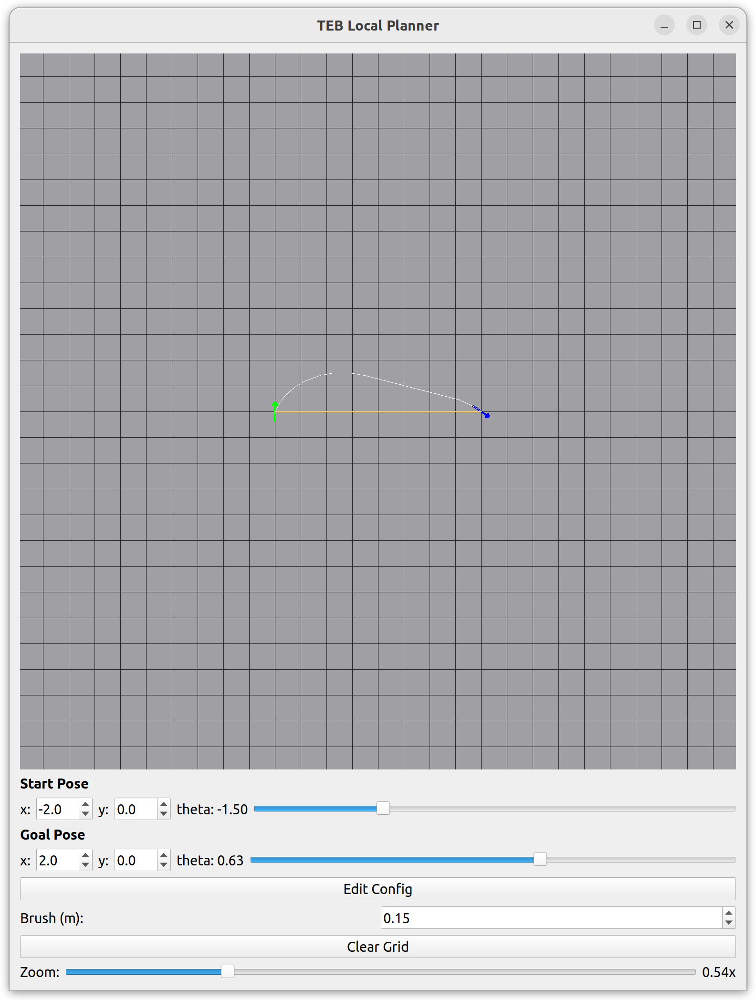

# teb_local_planner

TEB (Timed Elastic Band) 局部路径规划算法，非ROS版本移植，可作为第三方库集成到项目中。

原始代码和论文参考: [rst-tu-dortmund/teb_local_planner](https://github.com/rst-tu-dortmund/teb_local_planner)

## 编译

```bash
cd build && cmake .. && make -j$(nproc)
```

### 依赖

| 库 | 用途 |
|---|---|
| g2o | 图优化框架 |
| Eigen3 | 线性代数 |
| Boost (system, thread, graph) | 系统/线程/图工具 |
| Qt5 Widgets | GUI 可视化 |
| nlohmann/json | JSON 配置文件读写 (header-only, `apt install nlohmann-json3-dev`) |
| SuiteSparse | g2o 稀疏求解器依赖 |

## 运行

```bash
./build/teb
```

GUI 中的 **Save Scene** 和 **Open Scene** 按钮可将当前场景保存为 JSON 并重新加载。
场景包含栅格尺寸、所有占用栅格以及起点/终点的位置和朝向；规划器参数仍单独保存在
`teb_config.json` 中。打开场景后会自动重新规划。

场景文件使用 `*.teb_scene.json` 扩展名，格式版本当前为 1：

```json
{
  "version": 1,
  "grid": {"resolution": 0.05, "width": 400, "height": 400,
           "origin_x": -10.0, "origin_y": -10.0},
  "occupied_cells": [[10, 20], [11, 20]],
  "start": {"x": -2.0, "y": 0.0, "theta": 0.0},
  "goal": {"x": 2.0, "y": 0.0, "theta": 0.0}
}
```



## 库调用流程

```cpp
#include "inc/teb_config.h"
#include "inc/pose_se2.h"
#include "inc/robot_footprint_model.h"
#include "inc/obstacles.h"
#include "inc/optimal_planner.h"

using namespace teb_local_planner;

// 1. 加载配置
TebConfig config;                          // 默认参数，或 config.loadFromFile("teb_config.json");

// 2. 设置障碍物
std::vector<ObstaclePtr> obst_vector;
obst_vector.emplace_back(boost::make_shared<PointObstacle>(0, 0));

// 3. 设置机器人模型
RobotFootprintModelPtr robot_model = boost::make_shared<CircularRobotFootprint>(0.4);

// 4. 构造规划器
TebVisualizationPtr visual(new TebVisualization(config));
ViaPointContainer via_points;
TebOptimalPlanner planner(config, &obst_vector, robot_model, visual, &via_points);

// 5. 规划路径
PoseSE2 start(-2, 0, 0);
PoseSE2 goal(2, 0, 0);
planner.plan(start, goal);

// 6. 获取轨迹
std::vector<Eigen::Vector3f> path;
planner.getFullTrajectory(path);
// path[i] = [x, y, theta]
```

## 参数调优

~80 个参数中，以下是最关键的调优入口。推荐用 `rqt_reconfigure` 实时调整，一次只改 1~2 个参数。

### Tier 1 — 运动学约束（必须匹配硬件）

| 参数 | 默认值 | 说明 |
|---|---|---|
| `max_vel_x` | 0.4 | 最大前进速度 (m/s) |
| `max_vel_x_backwards` | 0.2 | 最大后退速度 (m/s) |
| `max_vel_theta` | 0.3 | 最大旋转角速度 (rad/s) |
| `acc_lim_x` | 0.5 | 最大线加速度 (m/s²) — **启动/停止抖动的常见原因**，可适当降低 |
| `acc_lim_theta` | 0.5 | 最大角加速度 (rad/s²) |
| `min_turning_radius` | 0.0 | 最小转弯半径（0=差速驱动，阿克曼车型必须设实际值） |

### Tier 2 — 避障（安全核心）

| 参数 | 默认值 | 说明 |
|---|---|---|
| `min_obstacle_dist` | 0.5 | 障碍物硬性最小距离 (m)。窄通道可降至 0.1~0.2 |
| `inflation_dist` | 0.6 | 膨胀缓冲区 (m)。需大于 `min_obstacle_dist` 才生效，通常设为 2~3 倍 |
| `obstacle_poses_affected` | 30 | 受障碍物影响的轨迹位姿数，减少可降低计算量 |

> 窄道通过公式：`最小通道宽 = 机器人宽度 + 2 × min_obstacle_dist`（另加 0.1~0.2m 安全裕度）

### Tier 3 — 行为权重（最常调）

| 参数 | 默认值 | 增大效果 |
|---|---|---|
| `weight_obstacle` | 50 | 远离障碍物。过高会在窄道振荡 |
| `weight_optimaltime` | 1.0 | 更激进更快。必须 > 0 |
| `weight_viapoint` | 1.0 | 更紧密跟随全局路径。过高则无法绕开障碍物 |
| `weight_kinematics_forward_drive` | 1.0 | 抑制倒车。设为 **1000** 可几乎禁止倒车 |
| `weight_inflation` | 0.1 | 膨胀区惩罚。保持较小 (0.1~0.2) |
| `weight_adapt_factor` | 2.0 | 每次外循环 `weight_obstacle` 的递增倍率 |

### Tier 4 — 轨迹质量与性能

| 参数 | 默认值 | 说明 |
|---|---|---|
| `dt_ref` | 0.3 | 轨迹时间分辨率 (s)。减小→更精细但 CPU 上升 |
| `no_inner_iterations` | 5 | 每次外循环的优化迭代次数 |
| `no_outer_iterations` | 4 | 外循环次数。**错过控制周期时优先降低此项** |
| `max_global_plan_lookahead_dist` | 3.0 | 前向规划距离 (m)。缩短→更灵敏 |
| `max_number_classes` | 4 | 备选拓扑数量。**CPU 占用最大的参数**，性能不足降为 2 |
| `feasibility_check_no_poses` | 5 | 碰撞检测位姿数。-1=全部（最安全但慢） |
| `enable_multithreading` | true | 多线程并行优化 |
| `global_plan_viapoint_sep` | -0.1 | 全局路径采样间隔。负值禁用，正值 (如 0.3) 生成密集 via-point |

### 常见问题速查

| 症状 | 最可能的修复 |
|---|---|
| 启动/停止抖动 | 降低 `acc_lim_x`、`acc_lim_theta` |
| 无法通过窄门 | 降低 `min_obstacle_dist` |
| 走廊内振荡 | 降低 `weight_obstacle`，减小 `inflation_dist` |
| 频繁倒车 | 设 `weight_kinematics_forward_drive: 1000` |
| 错过控制周期 | 先降 `max_number_classes`，再降 `no_outer_iterations` |
| 目标点附近徘徊 | 增大 `xy_goal_tolerance`、`yaw_goal_tolerance` |
| 偏离全局路径 | 增大 `weight_viapoint`，设置 `global_plan_viapoint_sep > 0` |

### 调优顺序

1. 先设 **Tier 1** 匹配实际硬件
2. 设 **Tier 2** 匹配环境（窄道 vs 开阔空间）
3. 用 **`Edit Config` 按钮**实时调整 Tier 3，每次只改一个权重
4. 只有 CPU 告警或轨迹粗糙时才动 Tier 4


### Acknowledge
https://github.com/linyicheng1/teb_local_planner
https://github.com/rst-tu-dortmund/teb_local_planner
